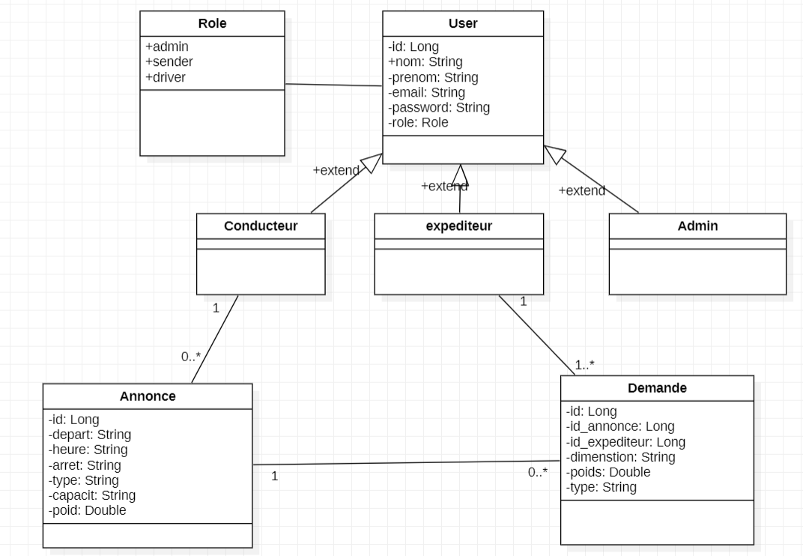
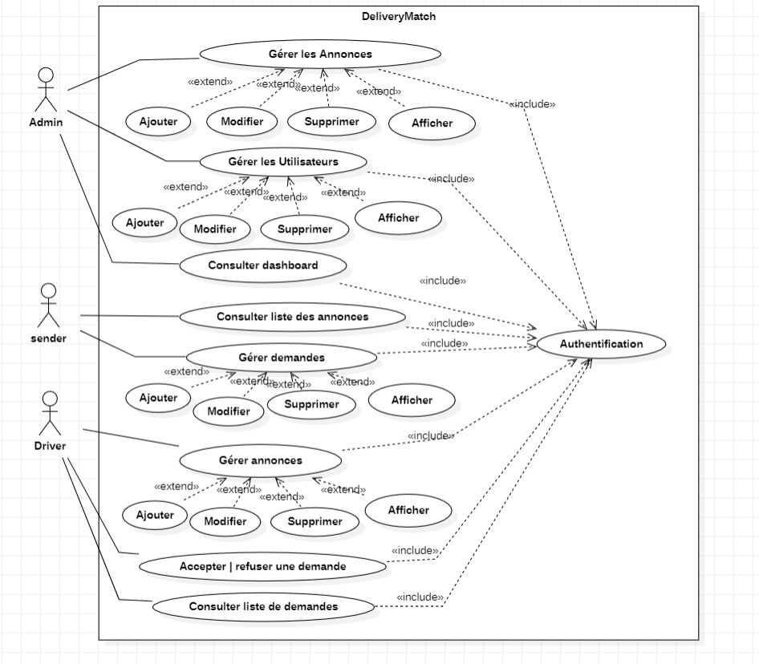
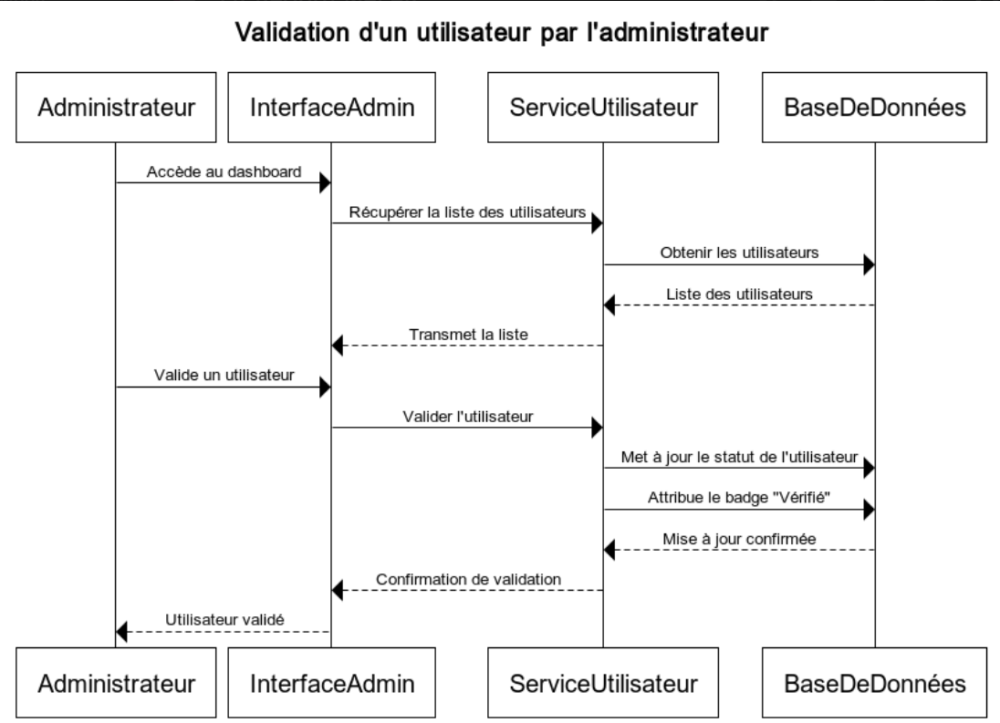

# 🚚 DeliveryMatch

DeliveryMatch est une plateforme web collaborative qui connecte les conducteurs disposant d’espace libre dans leur véhicule avec des expéditeurs souhaitant envoyer des colis à moindre coût. Elle vise à optimiser les trajets pour un transport plus **économique**, **écologique** et **intelligent**.

---

## 📌 Table des matières

- ✨ Fonctionnalités principales
- 👥 Rôles & Parcours utilisateurs
- 🛠️ Technologies utilisées
- 📊 Dashboard administrateur
- 🚀 Installation & lancement

---

## ✨ Fonctionnalités principales

- Authentification et inscription sécurisées
- Création et gestion d’annonces de trajets
- Système de demande d’envoi de colis avec validation
- Notifications automatiques (acceptation, refus, suivi d’état)
- Suivi des trajets, demandes et livraisons en temps réel
- Historique des échanges pour chaque utilisateur
- Système d’évaluation mutuelle (conducteur ↔ expéditeur)
- Interface d’administration avec gestion complète de la plateforme

---

## 👥 Rôles & Parcours Utilisateurs

### 👤 Utilisateur
- Inscription avec données personnelles (nom, email, mot de passe)
- Connexion et déconnexion sécurisées
- Modification des informations de profil
- Consultation de l’historique des activités et des notifications

### 🚗 Conducteur
- Création d’annonces de trajets (lieux, étapes, capacité, date, etc.)
- Gestion des demandes reçues (accepter/refuser)
- Suivi des trajets réalisés
- Évaluation des expéditeurs après livraison

### 📦 Expéditeur
- Recherche d’annonces selon des critères (destination, date, taille colis…)
- Envoi de demandes de transport avec détails du colis
- Suivi de l’état des demandes envoyées
- Évaluation des conducteurs après réception du colis

### 🛡️ Administrateur
- Tableau de bord centralisé pour la gestion de la plateforme
- Validation ou suspension de comptes utilisateurs
- Accès à des statistiques détaillées (utilisateurs actifs, taux de succès…)
- Possibilité de modifier ou supprimer des annonces, comptes ou demandes

---

## 🛠️ Technologies Utilisées

Couche – Technologies utilisées

- **_Frontend_** – Angular 16+, Angular Material, Tailwind CSS
- **_Backend_** – Spring Boot, Spring Data JPA, Spring Security
- **_Base de données_** – MySQL
- **_Documentation_** – Swagger, Postman Collection
- **_Tests_** – JUnit, Postman Tests
- **_Conteneurisation_** – Docker, Docker Compose
- **_Visualisation_** – Chart.js (graphiques pour l'administration)

---

## 📊 Dashboard Administrateur

- 📈 Suivi du nombre total d’annonces créées
- ✅ Affichage du taux d’acceptation des demandes
- 👥 Nombre d’utilisateurs actifs sur la plateforme
- 🗂️ Gestion complète des utilisateurs, annonces et demandes
- 📊 Statistiques et graphiques interactifs en temps réel
--------------------------------------------------------------------------------------
##  UML
**_Diagramme de Class_**

**_Diagramme de Cas d'utilisation_**

**_Diagramme de Séquence_**
